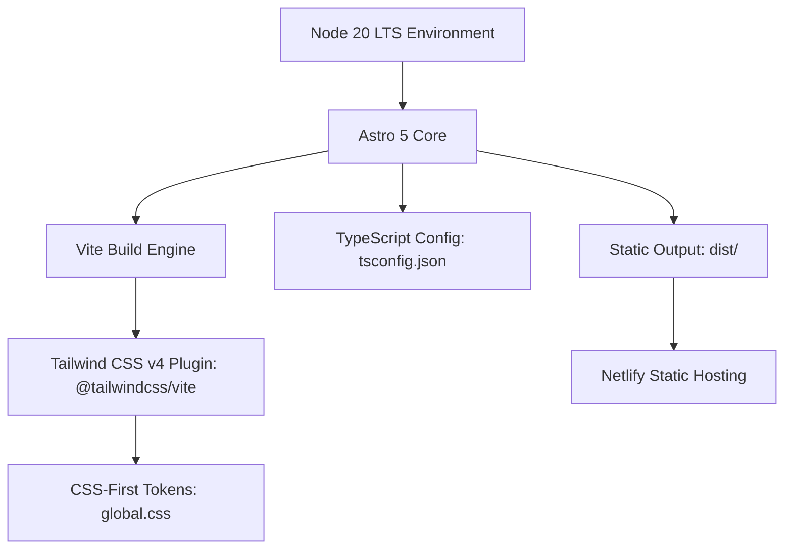

# Astro Migration Base Design

**Spec**: `.specs/features/astro-migration-base/spec.md`  
**Status**: Approved

---

## Architecture Overview

A nova arquitetura migra o core do site de um gerador Gatsby legado para o **Astro 5** com compilação via **Vite** e estilização através do **Tailwind CSS v4**.

---

## Code Reuse Analysis

### Existing Assets to Leverage

| Recurso / Ativo   | Localização Atual                       | Como será reutilizado                                                    |
| ----------------- | --------------------------------------- | ------------------------------------------------------------------------ |
| Posts Markdown    | `src/posts/*.md`                        | Serão preservados integralmente para importação nas collections do Astro |
| Favicon & Assets  | `src/assets/favicon.png`, `profile.png` | Movidos para `public/` ou `src/assets/` do Astro                         |
| Metadados Sociais | `config/metadata.js`                    | Centralizados em constante tipada TypeScript                             |

---

## Components and Interfaces

### 1. `astro.config.mjs`

- **Função**: Arquivo central de configuração do Astro.
- **Integrações**: `@tailwindcss/vite` em plugins do Vite.
- **Configuração de saída**: `output: 'static'`.

### 2. `src/styles/global.css`

- **Função**: Ponto de entrada do Tailwind CSS v4 e definição de tokens de design.
- **Conteúdo**: `@import "tailwindcss";` com diretivas `@theme` para cores minimalistas e tipografia limpa.

### 3. `src/layouts/BaseLayout.astro`

- **Função**: Template principal encapsulando `<html>`, `<head>`, metatags, script anti-FOUC de tema e container principal.
- **Props**: `title: string`, `description?: string`.

### 4. `src/pages/index.astro`

- **Função**: Página de teste de sanidade da base técnica, exibindo título, status da base e alternador visual claro/escuro.

---

## Tech Decisions

| Decisão                 | Escolha                            | Justificativa                                                                                 |
| ----------------------- | ---------------------------------- | --------------------------------------------------------------------------------------------- |
| Tailwind v4 Integration | `@tailwindcss/vite`                | Recomendação oficial do Tailwind para Vite e Astro 5, sem necessidade de `tailwind.config.js` |
| Modo de Renderização    | Static (SSG)                       | Zero servidor, hospedagem pura no CDN do Netlify via `dist/`                                  |
| Anti-FOUC Theme Script  | Script inline síncrono no `<head>` | Garante que a classe `dark` é aplicada antes do primeiro paint                                |

---

## Risks & Concerns

| Risco / Preocupação                                                   | Gravidade | Mitigação                                                                             |
| --------------------------------------------------------------------- | --------- | ------------------------------------------------------------------------------------- |
| Resquícios de dependências antigas gerando conflito no `node_modules` | Média     | Limpar `node_modules` e `package-lock.json` antes de instalar o pacote limpo do Astro |
| Conflito de porta do dev server (7777 vs 4321)                        | Baixa     | Configurar porta padrão do Astro ou manter conveniência local                         |
